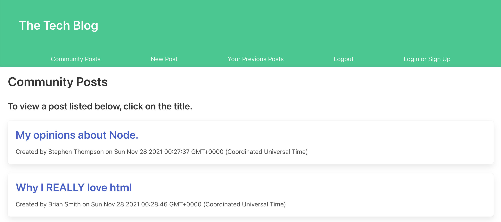

# Tech Blog

  ## Description

  This app allows users to create an account, login, and create/read/edit/delete blog posts. A video showing the functionality of this app can be found here: https://watch.screencastify.com/v/EM3IQqHFptTbPZbLmMnl. A link to the deployed application can be found here: https://still-refuge-81895.herokuapp.com/. This app was created using handlebars, express, mySQL and node. An image of the deployed application is shown below. 

  

  ## Table of Contents

  * [Installation](#installation)

  * [Questions](#questions)

  ## Installation

  To install necessary dependencies, run the following command:

  npm i

  ## Questions

  My GitHub profile can be found at https://github.com/SGThompsonChicago.
  You can contact me via email at s31@umbc.edu.

  
